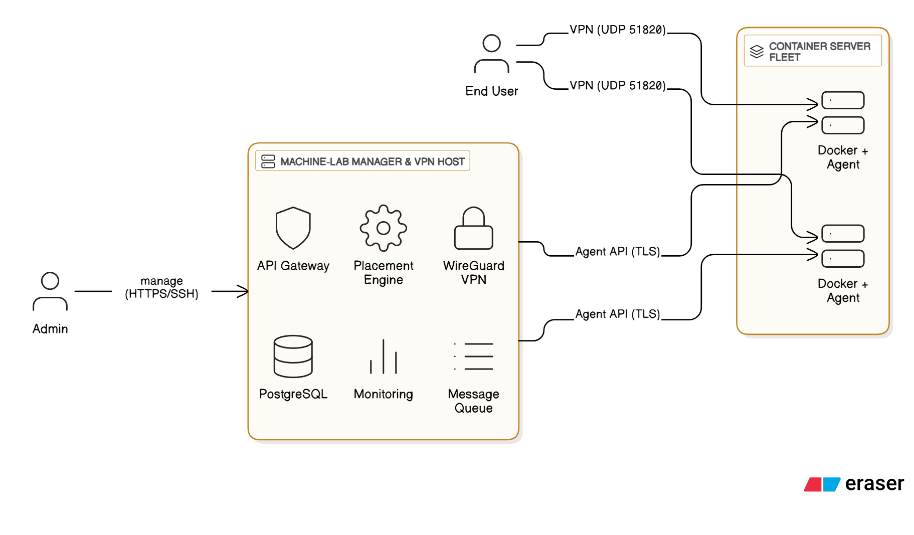
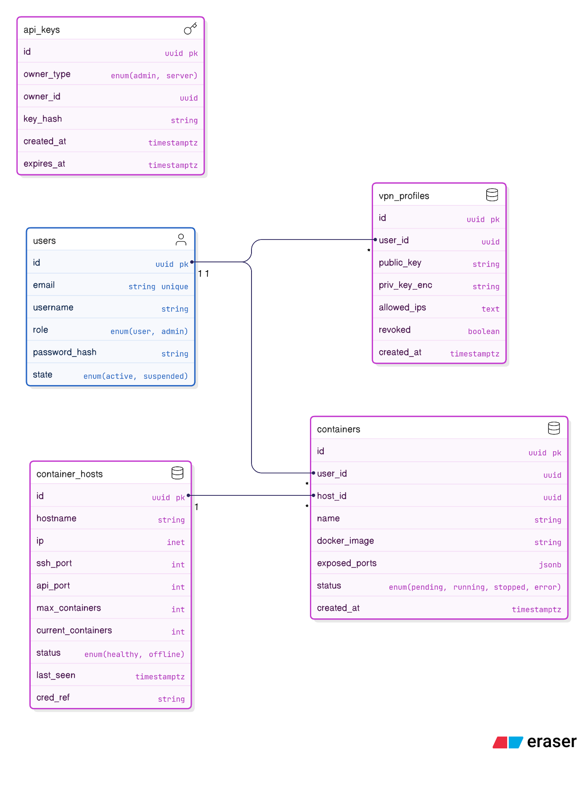
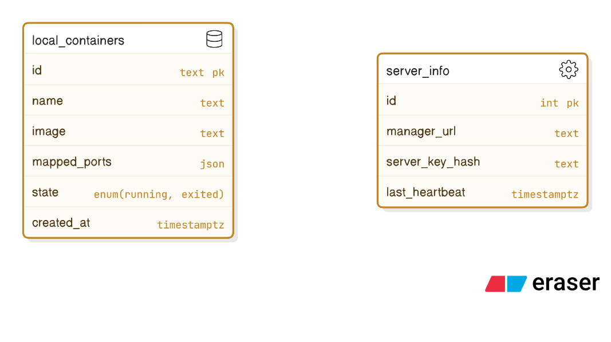

# Machine‑Lab Environment • Development Specification (v2)

---

## 1. Architecture Diagram (Eraser.io Cloud Arch Syntax)



```eraser
title Machine‑Lab System Architecture

Admin [icon: user, label: "Admin"]
User [icon: user, label: "End User"]

"Machine‑Lab Manager & VPN Host" [icon: server] {
  API Gateway [icon: shield]
  Scheduler [icon: settings, label: "Placement Engine"]
  "WireGuard VPN" [icon: lock]
  "Message Queue" [icon: list]
  DB [icon: database, label: "PostgreSQL"]
  Monitoring [icon: bar-chart-2]
}

"Container Server Fleet" [icon: layers] {
  "Container Server 1" [icon: server, label: "Docker + Agent"]
  "Container Server n" [icon: server, label: "Docker + Agent"]
}

// Connections
Admin > "Machine‑Lab Manager & VPN Host": "manage (HTTPS/SSH)"
User > "Container Server 1": "VPN (UDP 51820)"
User > "Container Server n": "VPN (UDP 51820)"

"Machine‑Lab Manager & VPN Host" > "Container Server 1": "Agent API (TLS)"
"Machine‑Lab Manager & VPN Host" > "Container Server n": "Agent API (TLS)"
```

**Highlights**

- **Manager + VPN Co‑location**: The WireGuard service lives on the same host as the API/Scheduler stack; only **admins** can reach the API over an internal or admin‑only VPN profile.
- **Data Plane Isolation**: Users connect *directly* to container servers through WireGuard. The Manager’s REST/gRPC endpoints are never exposed to regular users.
- **Single Control Authority**: All container servers authenticate inbound commands with a **server key** issued by the Manager at registration.

---

## 2. Database Structure (ER Diagrams in Eraser Syntax)

### 2.1 Machine‑Lab Manager DB



```eraser
container_hosts [icon: database, color: purple] {
  id uuid pk
  hostname string
  ip inet
  ssh_port int
  api_port int
  max_containers int
  current_containers int
  status enum(healthy, offline)
  last_seen timestamptz
  cred_ref string
}

containers [icon: database, color: purple] {
  id uuid pk
  user_id uuid
  host_id uuid
  name string
  docker_image string
  exposed_ports jsonb
  status enum(pending, running, stopped, error)
  created_at timestamptz
}

users [icon: user, color: blue] {
  id uuid pk
  email string unique
  username string
  role enum(user, admin)
  password_hash string
  state enum(active, suspended)
}

vpn_profiles [icon: database, color: purple] {
  id uuid pk
  user_id uuid
  public_key string
  priv_key_enc string
  allowed_ips text
  revoked boolean
  created_at timestamptz
}

api_keys [icon: key, color: purple] {
  id uuid pk
  owner_type enum(admin, server)
  owner_id uuid
  key_hash string
  created_at timestamptz
  expires_at timestamptz
}

// Relationships
container_hosts.id < containers.host_id
users.id < containers.user_id
users.id < vpn_profiles.user_id
api_keys.owner_id "depends on" users.id
```

### 2.2 Container Server Local State (lightweight SQLite)



```eraser
local_containers [icon: database, color: orange] {
  id text pk            // Docker container ID
  name text
  image text
  mapped_ports json
  state enum(running, exited)
  created_at timestamptz
}

server_info [icon: settings, color: orange] {
  id int pk
  manager_url text
  server_key_hash text
  last_heartbeat timestamptz
}
```

*Container servers store only ephemeral bookkeeping; authoritative state lives in the Manager DB.*

---

## 3. API Modules

### 3.1 Machine‑Lab Manager

| Module                       | Purpose                                                                                       | Auth Mechanism                                              |
| ---------------------------- | --------------------------------------------------------------------------------------------- | ----------------------------------------------------------- |
| **Auth Module**              | Issues & validates **admin keys** (for UI/CLI) and **server keys** (for container servers).   | Admin login (email + password) ⇒ JWT ⇒ `X‑Admin‑Key` header |
| **User Module**              | Manages user accounts & WireGuard profiles (create, revoke, rotate).                          | `X‑Admin‑Key`                                               |
| **Container Host Module**    | Register, update, delete container servers; track health & metrics.                           | `X‑Admin‑Key` for mutation; server key for heartbeat        |
| **Running Container Module** | Launch, stop, inspect containers across the fleet.                                            | `X‑Admin‑Key`                                               |
| **Connectivity Module**      | Updates VPN ACLs so that *only the requesting user* can reach the container’s IP\:port tuple. | Internal call (no external endpoint)                        |

### 3.2 Container Server

| Module             | Purpose                                                               | Auth Mechanism                           |
| ------------------ | --------------------------------------------------------------------- | ---------------------------------------- |
| **Command Module** | Receives signed commands (`start`, `restart`, `remove`) from Manager. | `X‑Server‑Key` header validated via HMAC |
| **Status Module**  | Reports per‑container state & resource usage to Manager.              | `X‑Server‑Key`                           |
| **Health Module**  | Heartbeat every N seconds; returns CPU/RAM/uptime.                    | `X‑Server‑Key`                           |

---

## 4. API Endpoints

Below is a *concise* listing—grouped by module—showing HTTP method, path, key headers, and core request/response shapes (simplified).

### 4.1 Auth Module (Manager)

- **POST /auth/login** → obtain admin key

  - Body: `{ "email": "admin@example.com", "password": "secret" }`
  - Response `200`: `{ "admin_key": "<token>", "expires": "2025‑07‑20T00:00:00Z" }`

- **POST /auth/server‑key** (admin‑only) → issue key for new container server

  - Header: `X‑Admin‑Key: <token>`
  - Body: `{ "host_id": "<uuid>" }`
  - Response: `{ "server_key": "<token>", "pub_fingerprint": "…" }`

### 4.2 User Module (Manager)

- **POST /users** – create user

  - Header: `X‑Admin‑Key`
  - Body: `{ "email": "u@corp.local", "username": "alice" }`
  - Response `201`: user object

- **POST /vpn/users/{user\_id}** – generate WireGuard profile

  - Header: `X‑Admin‑Key`
  - Response: `200` ⇒ file download (`Content‑Disposition: attachment; filename="alice.conf"`)

- **DELETE /vpn/{profile\_id}** – revoke profile

  - Header: `X‑Admin‑Key`
  - Response `204`

### 4.3 Container Host Module (Manager)

- **POST /hosts** – register host (first handshake)

  - Header: `X‑Admin‑Key`
  - Body: `{ "hostname": "cs‑01", "ip": "10.0.2.5", "max_containers": 30 }`
  - Response: `{ "host_id": "<uuid>", "server_key": "<token>" }`

- **POST /hosts/{id}/heartbeat** – (from server)

  - Header: `X‑Server‑Key`
  - Body: `{ "cpu": 27, "mem": 43, "containers": 12 }`
  - Response `200`: `{ "ack": true }`

### 4.4 Running Container Module (Manager)

- **POST /containers** – launch container

  - Header: `X‑Admin‑Key`
  - Body:
    ```json
    {
      "name": "lab‑nginx",
      "ports": [80, 443],
      "docker_zip_url": "https://example.com/src.zip",
      "user_id": "<uuid>"
    }
    ```
  - Response `202`:
    ```json
    {
      "request_id": "<uuid>",
      "status": "scheduled"
    }
    ```

- **DELETE /containers/{id}** – stop & remove

  - Header: `X‑Admin‑Key`
  - Response `202`: `{ "status": "terminating" }`

- **GET /containers/{id}** – inspect

  - Header: `X‑Admin‑Key`
  - Response `200`: container object

### 4.5 Command Module (Container Server)

- **POST /agent/containers** – start container (called by Manager)

  - Header: `X‑Server‑Key`
  - Body: includes base64 zip or image name & port map
  - Response: `{ "container_id": "…", "mapped_ports": {"80":10800}}`

- **DELETE /agent/containers/{id}** – stop container

- **PATCH /agent/containers/{id}/restart** – restart container

### 4.6 Status & Health Modules (Container Server)

- **GET /agent/containers** – list all running containers
- **GET /agent/health** – basic health check `{ "uptime": 3600, "cpu": 23, "mem": 40 }`

---

### Security Notes

- All endpoints **require** either `X‑Admin‑Key` or `X‑Server‑Key` (HMAC‑SHA header) except `/auth/login`.
- Keys are single‑use tokens hashed in DB; revocation propagates instantly.
- WireGuard ACL updates occur **after** container creation, ensuring users cannot probe stale ports.

---
