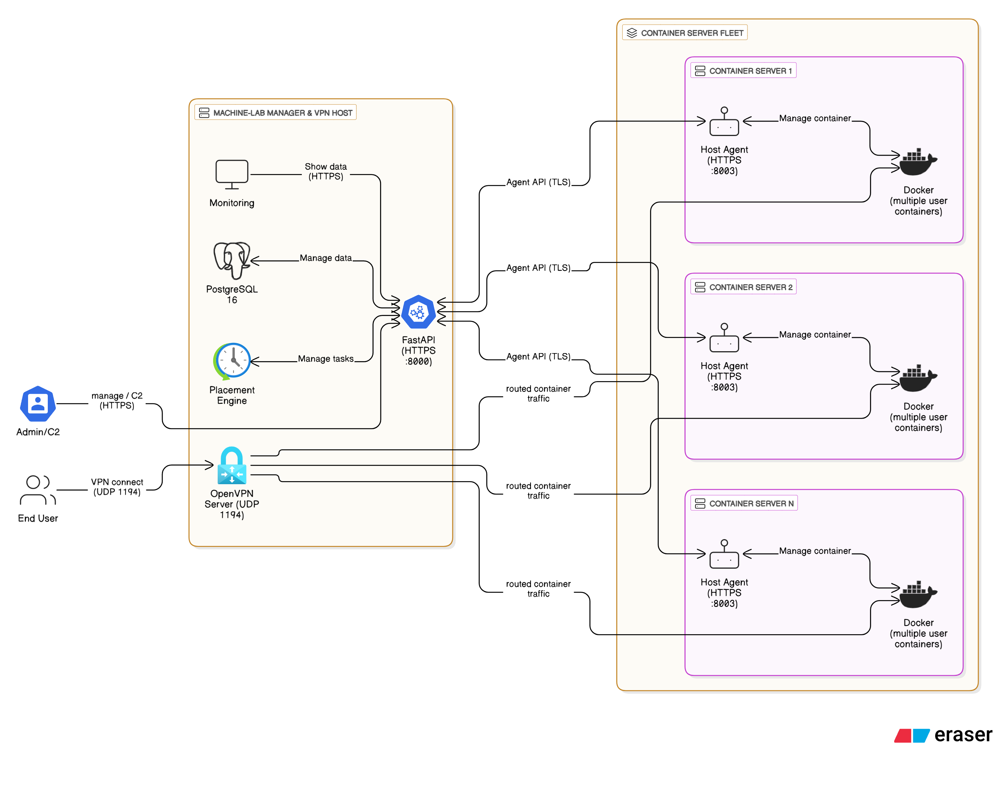

# Machine‑Lab Environment • Development Specification (v2)

---

## 1. Architecture Diagram (Eraser.io Cloud Arch Syntax)



```eraser
title Machine-Lab System Architecture

Admin [icon: k8s-user, label: "Admin / C2"]
User  [icon: users,    label: "End User"]

"Machine-Lab Manager & VPN Host" [icon: server] {
  API_Gateway  [icon: k8s-api,          label: "FastAPI  (HTTPS :8000)"]
  Scheduler    [icon: azure-scheduler,  label: "Placement Engine"]
  OpenVPN      [icon: azure-vpn-gateway,label: "OpenVPN Server (UDP 1194)"]
  DB           [icon: postgres,         label: "PostgreSQL 16"]
  Monitoring   [icon: monitor]
}

"Container Server Fleet" [icon: layers] {
  "Container Server 1" [icon: server] {
    Docker1  [icon: docker, label: "Docker (multiple user containers)"]
    Agent1   [icon: agent,  label: "Host Agent (HTTPS :8003)"]
  }
  "Container Server 2" [icon: server] {
    Docker2  [icon: docker, label: "Docker (multiple user containers)"]
    Agent2   [icon: agent,  label: "Host Agent (HTTPS :8003)"]
  }
  "Container Server n" [icon: server] {
    Dockern  [icon: docker, label: "Docker (multiple user containers)"]
    Agentn   [icon: agent,  label: "Host Agent (HTTPS :8003)"]
  }
}

// Control-plane connections
Admin  > API_Gateway:             "manage / C2  (HTTPS)"
Monitoring  > API_Gateway:            "Show data (HTTPS)"
Scheduler  <> API_Gateway:            "Manage tasks"
DB  <> API_Gateway:            "Manage data"

API_Gateway <> Agent1:             "Agent API (TLS)"
API_Gateway <> Agent2:             "Agent API (TLS)"
API_Gateway <> Agentn:             "Agent API (TLS)"

// Data-plane (VPN) traffic
User  > OpenVPN:                  "VPN connect  (UDP 1194)"
OpenVPN > Docker1:                "routed container traffic"
OpenVPN > Docker2:                "routed container traffic"
OpenVPN > Dockern:                "routed container traffic"

Agent1 <> Docker1:                "Manage container"
Agent2 <> Docker2:                "Manage container"
Agentn <> Dockern:                "Manage container"

```

**Highlights**

- **Manager + VPN Co‑location**: The WireGuard service lives on the same host as the API/Scheduler stack; only **admins** can reach the API over an internal or admin‑only VPN profile.
- **Data Plane Isolation**: Users connect *directly* to container servers through WireGuard. The Manager’s REST/gRPC endpoints are never exposed to regular users.
- **Single Control Authority**: All container servers authenticate inbound commands with a **server key** issued by the Manager at registration.

---

## 2. Database Structure (ER Diagrams in Eraser Syntax)


```eraser
// ────────────────────────
//  Machine-Lab - DB Schema
// ────────────────────────

users [icon: user, color: blue] {
  id            uuid  pk
  email         string unique
  username      string
  password_hash string
  role          enum(userrole)
  state         enum(userstate)
}

container_hosts [icon: database, color: purple] {
  id                 uuid  pk
  hostname           string
  ip                 inet
  ssh_port           int
  api_port           int
  max_containers     int
  current_containers int
  cpu_percent        int          // % utilisation (0-100)
  mem_percent        int          // % utilisation (0-100)
  status             enum(hoststatus)
  last_seen          timestamptz
  cred_ref           string
}

containers [icon: database, color: purple] {
  id         uuid  pk
  user_id    uuid
  host_id    uuid
  name       string
  status     enum(containerstatus)
  created_at timestamptz
}

vpn_profiles [icon: database, color: purple] {
  id          uuid  pk
  client_name string
  config_path text
  revoked     boolean
  created_at  timestamptz
  ip_address  inet  unique
}

api_keys [icon: key, color: purple] {
  id         uuid  pk
  owner_type enum(apikeyowner)
  owner_id   uuid
  key_hash   string
  created_at timestamptz
  expires_at timestamptz
}

// ────────────
// Relationships
// ────────────
container_hosts.id <> containers.host_id
vpn_profiles.client_name <> containers.user_id
vpn_profiles.client_name <> containers.id
// api_keys.owner_id may reference either a user or a server record;
// modelled here as a loose association:
users.id <> api_keys.owner_id
```

---

## 3  API Modules (Manager)

| Module          | Prefix        | Who may call it                          | Main purpose                                        |
| --------------- | ------------- | ---------------------------------------- | --------------------------------------------------- |
| **Auth**        | `/auth`       | Admin only                               | Sign-in, change password, rotate admin key          |
| **Hosts**       | `/hosts`      | Admin for CRUD; Host-agent for heartbeat | Register & manage container hosts, track health     |
| **Users (VPN)** | `/users`      | Admin only                               | Issue, rotate, or download user VPN profiles        |
| **Containers**  | `/containers` | Admin only                               | Schedule, restart, stop, or inspect user containers |

> **Authentication headers**
>
> * Admin requests → `X-Admin-Key: <jwt>` (validated by `get_current_admin`);
> * Host heartbeat → `X-Server-Key: <jwt>` (validated by `get_server_key`);

Both headers are opaque JWTs whose hashes are stored in `api_keys` and are never returned once revoked.

---

## 4  Endpoint Catalogue (Manager)

### 4.1  /auth ( Auth Module );

| Method | Path                    | Body / Params                                          | Returns                                          | Notes                                         |
| ------ | ----------------------- | ------------------------------------------------------ | ------------------------------------------------ | --------------------------------------------- |
| `POST` | `/auth/login`           | `{ "email": "<admin @>", "password": "<plain>" }`      | `{ "admin_key": "<JWT>", "expires": null }`      | Issues a **timeless** key and stores its hash |
| `POST` | `/auth/change-password` | `{ "current_password": "...", "new_password": "..." }` | `{ "message": "Password changed successfully" }` | `X-Admin-Key` required                        |
| `POST` | `/auth/rotate-key`      | —                                                      | `{ "message": "...", "admin_key": "<new JWT>" }` | Revokes all prior keys for the caller         |

---

### 4.2  /hosts ( Hosts Module );

| Method   | Path                         | Body / Query               | Returns                   | Auth                          |
| -------- | ---------------------------- | -------------------------- | ------------------------- | ----------------------------- |
| `GET`    | `/hosts`                     | —                          | `[HostInfo]`              | Admin                         |
| `GET`    | `/hosts/{host_id}/status`    | —                          | `HostStatusResponse`      | Admin                         |
| `POST`   | `/hosts`                     | `HostCreate`               | `{ host_id, server_key }` | Admin                         |
| `PATCH`  | `/hosts/{host_id}`           | `HostUpdate` (partial)     | `HostInfo`                | Admin                         |
| `DELETE` | `/hosts/{host_id}`           | —                          | *204 No Content*          | Admin                         |
| `POST`   | `/hosts/{host_id}/heartbeat` | `{ cpu, mem, containers }` | `{ "ack": true }`         | Host-agent via `X-Server-Key` |

**Data model highlights**

```jsonc
// HostCreate / HostInfo fields
{
  "hostname": "docker-node-1",
  "ip": "10.0.2.17",
  "ssh_port": 22,
  "api_port": 8003,
  "max_containers": 20
}
```

Health-status values derive from CPU / MEM thresholds (75 % = warning, 90 % = critical).;

---

### 4.3  /users ( VPN Module );

| Method | Path                              | Body                        | Returns     | Notes                                        |                                             |
| ------ | --------------------------------- | --------------------------- | ----------- | -------------------------------------------- | ------------------------------------------- |
| `POST` | `/users/vpn`                      | \`{ "client\_name": "\<uuid email>" }\`   | `.ovpn` file stream           |              | Idempotent: returns existing or new profile |
| `POST` | `/users/vpn/{client_name}/rotate` | —                           | new `.ovpn` | Revokes old profile, assigns fresh static IP |                                             |

Both routes stream the profile with content-type `application/x-openvpn-profile`.

---

### 4.4  /containers ( Containers Module );

| Method   | Path                                 | Body / Param            | Returns                 | Flow                                                                           |
| -------- | ------------------------------------ | ----------------------- | ----------------------- | ------------------------------------------------------------------------------ |
| `POST`   | `/containers/launch?user_id=<uuid>`  | `file=` zip (multipart) | `{ id, host_id }`       | Picks least-loaded host, creates container+VPN pair, whitelists user↔container |
| `POST`   | `/containers/{container_id}/restart` | —                       | `{ "detail": "..." }`   | Forwards to agent `/restart`                                                   |
| `DELETE` | `/containers/{container_id}`         | —                       | `{ "detail": "..." }`   | Agent delete → revoke VPN, remove DB row                                       |
| `GET`    | `/containers/{container_id}`         | —                       | `ContainerInfoResponse` | Combines agent inspect + DB + VPN IP                                           |
| `GET`    | `/containers`                        | —                       | `[Container]`           | Pure DB list (no live status)                                                  |

**Agent interaction**

Manager calls host-agent endpoints:

```
POST http://<host_ip>:<api_port>/agent/containers
POST http://<host_ip>:<api_port>/agent/containers/{name}/restart
DELETE http://<host_ip>:<api_port>/agent/containers/{name}
GET  http://<host_ip>:<api_port>/agent/containers
```

and authenticates each request with `X-Server-Key: <token stored in host.cred_ref>`.;

---

### 4.5  Common response & enum types

| Enum              | Values                                      |
| ----------------- | ------------------------------------------- |
| `HostStatus`      | `offline`, `healthy`                        |
| `Healthiness`     | `offline`, `healthy`, `warning`, `critical` |
| `ContainerStatus` | `pending`, `running`, `stopped`, `error`    |

Timestamps are ISO-8601 strings in UTC (e.g. `2025-06-21T12:34:56Z`).

---


### Using these docs

* **Admin workflow**: `POST /auth/login` → save `admin_key` → pass as `X-Admin-Key` to any subsequent call.
* **Host bootstrap**: Admin registers a node → receives `server_key` → place it in the agent’s `X-Server-Key` header for heartbeats and container operations.

Below is an **add-on section for the documentation** that complements the Manager API reference you already have.
Just append it after Sections 3-4 (Manager) and you’ll have a complete picture of both sides of the control-plane.

---

## 5  API Modules (Host Agent)

| Module         | Prefix   | Who may call it                               | Purpose                                                                                                   |
| -------------- | -------- | --------------------------------------------- | --------------------------------------------------------------------------------------------------------- |
| **Agent Core** | `/agent` | Machine-Lab Manager only (via `X-Server-Key`) | Full life-cycle control of the Docker Compose “sandbox” that lives on this host and node telemetry/health |

### Authentication

Every request from the Manager carries
`X-Server-Key: <jwt>`

* The key is issued when the host is first registered (`/hosts POST` on the Manager) and its SHA-256 hash is stored in **container\_hosts.cred\_ref**.
* All routes in the agent’s FastAPI router are protected by `Depends(get_server_key)`.

---

## 6  Endpoint Catalogue (Host Agent)

| Method   | Path                               | Body / Param          | Returns                                                            | Summary                                                              |
| -------- | ---------------------------------- | --------------------- | ------------------------------------------------------------------ | -------------------------------------------------------------------- |
| `GET`    | `/agent/containers`                | —                     | `List[ContainerInfo]`                                              | List **running** containers on this host                             |
| `POST`   | `/agent/containers`                | **StartContainerReq** | `ActionResponse` `{"name":…, "status":"started"}`                  | *Unpack → `docker compose up -d`* a brand-new environment            |
| `POST`   | `/agent/containers/{name}/restart` | —                     | `ActionResponse` `{"name":…, "status":"restarted"}`                | Re-build images and restart the Compose stack                        |
| `DELETE` | `/agent/containers/{name}`         | —                     | `ActionResponse` `{"name":…, "status":"removed"}`                  | `docker compose down --volumes --rmi all` + delete work-dir          |
| `GET`    | `/agent/health`                    | —                     | `{ uptime_seconds, running_containers, mem_percent, cpu_percent }` | Node heartbeat payload consumed by Manager’s `/hosts/{id}/heartbeat` |

### 6.1  Data models

```jsonc
// ContainerInfo
{
  "id": "d5f6c8…",
  "name": "user123-devlab",
  "image": "python:3.12-slim",
  "status": "running"        // matches Docker state
}

// StartContainerReq
{
  "name": "user123-devlab",
  "docker_zip_base64": "<base64-encoded ZIP containing docker-compose.yml & context>",
  "vpn_conf_base64":   "<base64-encoded .ovpn profile tied to this user>"
}

// ActionResponse
{
  "name": "user123-devlab",
  "status": "started" | "restarted" | "removed"
}
```

### 6.2  Workflow in practice

1. **Manager decides placement** (`POST /containers/launch`).
2. Manager `POST`s to `http://<host_ip>:<api_port>/agent/containers` with:

   * Compose bundle for the sandbox
   * The user’s **OpenVPN** client config (`vpn_conf_base64`) that grants access **only** to the container’s private IP/ports.
3. Agent:

   * Wipes any old workspace at `/opt/containers/<name>/`.
   * Saves & extracts the ZIP → runs `docker compose up -d`.
   * Saves the `.ovpn` profile beside the stack (handy for future audits).
4. Manager records the container row (`containers` table) and updates `current_containers` counter on the host.
5. Periodically the Manager hits `/agent/health`; the agent returns CPU, RAM, runtime container count, and uptime so the Manager can compute `healthy / warning / critical` host status.

> **Failure handling**
> If steps 2-3 raise an exception (`subprocess.CalledProcessError`), the agent responds **500** with the exact command failure. The Manager can mark the host “error” and retry elsewhere.

---

### 6.3  Quick test with `curl`

```bash
SERVER_KEY=<your-new-host-token>
zip -r ctx.zip docker-compose.yml .
base64 -w0 ctx.zip  > ctx.b64
base64 -w0 user123.ovpn > vpn.b64

curl -X POST http://10.0.2.17:8003/agent/containers \
  -H "X-Server-Key: $SERVER_KEY" \
  -H "Content-Type: application/json" \
  -d @- <<EOF
{
  "name": "user123-devlab",
  "docker_zip_base64": "$(cat ctx.b64)",
  "vpn_conf_base64": "$(cat vpn.b64)"
}
EOF
```

A **201 Created** with `{ "name": "user123-devlab", "status": "started" }` confirms everything is wired correctly.

---

With these additions your documentation now covers **both** halves of the platform:

* **Manager (control-plane)** — Sections 3 & 4
* **Host Agent (data-plane worker)** — Sections 5 & 6

Feel free to integrate this into your README / docs site or let me know if any details need refining!
